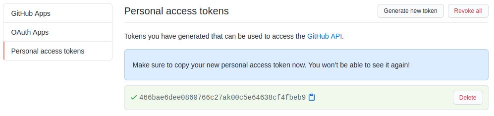
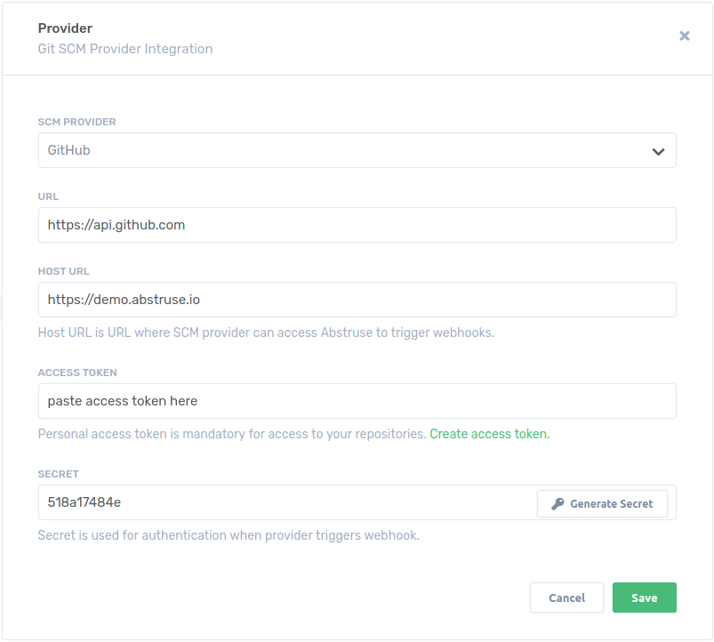

# GitHub Integration
<br>

### 1. Create GitHub token
**Abstruse** uses a personal access token to communicate with GitHub. We need to create one.<br>Login to GitHub and navigate to `Setting/Developer settings/Personal access tokens`
<br>
Click on `Generate new Token`. We only need access to `repo`
<br>
Click on `Generate token` and save the token
<br>

### 2. On Abstruse add GitHub provider
On **Abstruse** navigate to the provider's page. Click on the profile picture and select `Providers`
<br>
Click on `Add Provider`
<br>
Select the GitHub provider and paste the access token to the field. Copy the generated secret that will be needed in the next step. Click `Save`.

### 3. Add GitHub webhook
To add a webhook, login to GitHub and navigate to repository and then `Settings/Webhooks` 
<br>
Click on `Add webhook`
<br>Under **Playload URL** add the URL to your **Abstruse** and attach the `/webhooks` path to it `https://demo.abstruse.io/webhooks`
<br>Under **Secret** paste the secret from the previous step
<br>Under **Which events would you like to trigger this webhook?** select `Let me select individual events.` and check **Branch or tag creation, Branch or tag deletion**, **Pull requests** and **Pushes**
<br> 
Click `Add webhook`

### 4. Protect master branch
In order to protect the master branch with **Abstruse**, login to GitHub and navigate to the repository and then `Settings/Branches`
<br>
Click on `Add Role`. Type in `master` as the branch and check **Require status checks to pass before merging**, **Require branches to be up to date before merging** and **continuous-integration**
<br>

### 5. Enable repository in Abstruse
Go to **Abstruse** and navigate to the `Repositories` page and turn on the repository
<br>

### 6. Create PR
We are good to go. Here is a simple example on how to test everything. Create a PR with these two files in the root of the project:

`Makefile`:
```makefile
test:
	@echo "testing..."
	
.PHONY: test
```

`.abstruse.yml`:
```yaml
image: golang:1.15

matrix:
  - env: CMD=test

script:
  - if [[ "$CMD" ]]; then make $CMD; fi
```